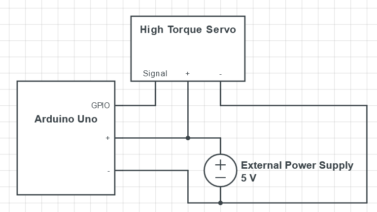

# Arduino Circuits

In this project, the Arduino controlls the servo's, weight sensor and pump. The circuits will be described in this file.

## High Torque Servo

In order to make the High Torque Servo work, you should at all times use an external power supply, as the 5V does not have enough amperage to power the High Torque Servo proficiently. This problem becomes even more critical when you attach multiple instances to the Arduino. For this reason, we are going to use a powerful power supply that provides as much 5V power amperage as needed for to make the servo's and pump function. The circuit for connecting a High Torque Servo is shown below.

1. **External Power Supply:** Connect the positive (+) and negative (-) terminals of the external power supply to the corresponding terminals on the High Torque Servo.

2. **Signal Wire:** Connect the signal wire from the High Torque Servo to a digital GPIO pin on the Arduino. Note that the Arduino and Servo will need to share a ground to the External Power Supply for the Arduino to be able to send signals.

3. **Power Supply to Arduino:** Connect the external power supply to the Arduino.

## Pump

In order to make the pump work, we are going to use a relais to switch the 12v power on/off. The circuit required for this ordeal is as follows:

