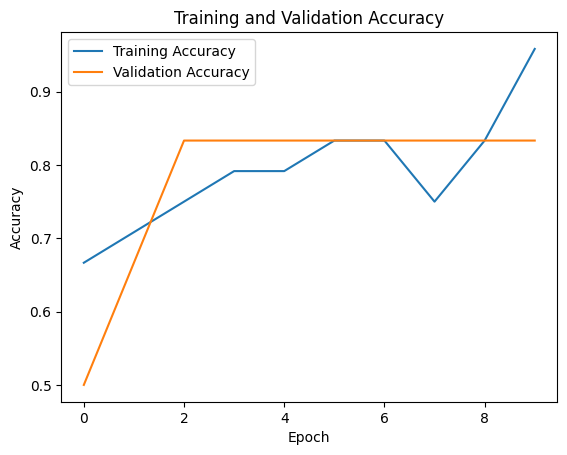
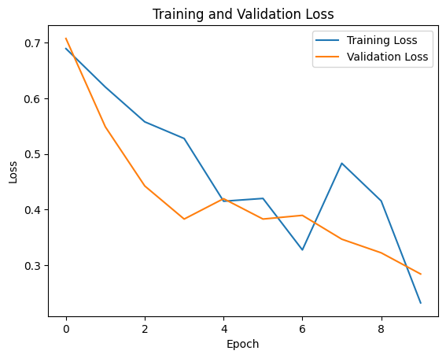

# Artificial Intelligence Model

To solve the issue of detecting when it is okay to pour water/beer in the cup, we decided to create a machine learning model that does binary classification to decide if it is safe to tap.

## Model

As seen in the code cell below, the model created takes an input shape of 64 by 64 with a color depth of 3. This means that all of the input from the camera should be formatted in this exact way before performing the binary classification.

The first step in this model is to perform two layers of 2D convolution and max pooling. This is done for the sake of feature selection. After that, the layers are flattened and processed by a dense neural network, which calculates the chance of the picture containing image data of the machine being ready to tap. The dense neural network contains weights that have been fitted to training data, which allows it to detect wether the picture should be classified as a 0 or 1 depending on the previously fed training images.

```python
# The model in python
model = tf.keras.Sequential([
    tf.keras.layers.Conv2D(32, (3, 3), activation='relu', input_shape=(64, 64, 3)),
    tf.keras.layers.MaxPooling2D((2, 2)),
    tf.keras.layers.Conv2D(64, (3, 3), activation='relu'),
    tf.keras.layers.MaxPooling2D((2, 2)),
    tf.keras.layers.Flatten(),
    tf.keras.layers.Dense(128, activation='relu'),
    tf.keras.layers.Dropout(0.5),
    tf.keras.layers.Dense(1, activation='sigmoid')
])
```

## Performance

As for now, we don't have a good testing prototype, so the images the model has been fitted to are unusable in the future. Creating a correct dataset should be the first priority after a prototype with the Raspberry Pi Camera and Cup Holder functions correctly. For now, the performance with 30 palceholder test images is:





## Usage

To use this model, you simply copy the .h5 model output (saved model information/weights) and you replace the one that's in the raspberry-pi repository. After correcting the model path in the main.py, you should now be able to use the model trained using the python notebook.
