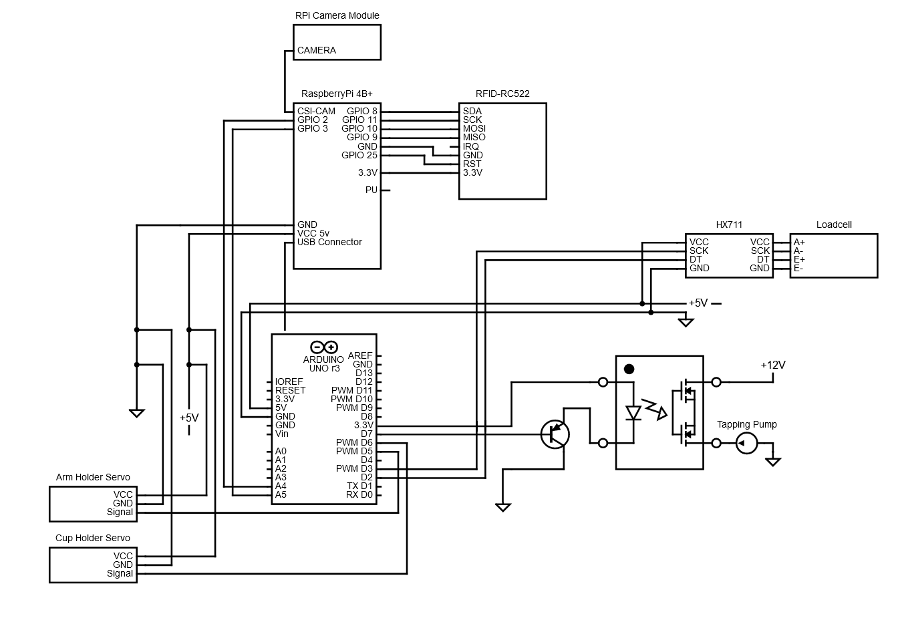

# Prototype

This page describes and shows all the physical connections of the circuits. The physical prototype and hardware are also shown in pictures with lables.

## Main circuit diagram

The **Vrijtap** project contains actuators and sensors connected to a breadboard, Arduino Uno and RaspberryPi 4B+.
These are shown in the diagram shown below:

