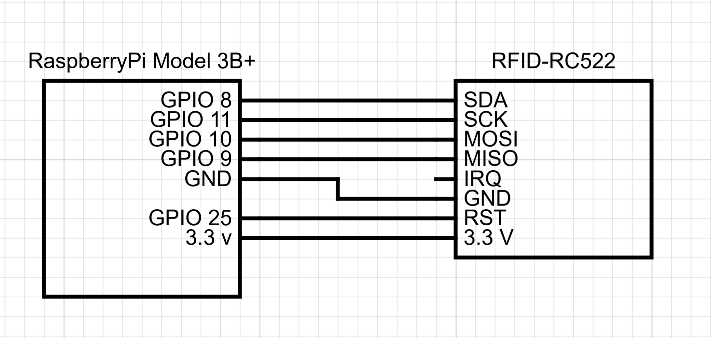

# Raspberry Pi Circuit

In this project, the Raspberry Pi only controlls the RFID scanner and a preasure sensor for creating an interrupt. The circuit will be described in this file.

## The Rfid reader

The project uses an RFID reader to read the user cards, this reader is connected via a set of wires which are connected as seen in the image below:

This sensor runs on 3.3V supplied by the connected RaspberryPi.