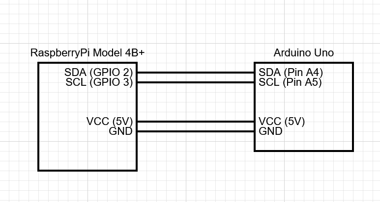

# Raspberry Pi Circuit

In this project, the Raspberry Pi only controlls the RFID scanner and a preasure sensor for creating an interrupt. The circuit will be described in this file.

## The Rfid reader

The project uses an RFID reader to read the user cards, this reader is connected via a set of wires which are connected as seen in the image below:

This sensor runs on 3.3V supplied by the connected RaspberryPi.

## The I2C connection

The project uses two wires to communicate with the arduino uno, this is done via the I2C protocol. These two wires are connected to the SDA and SCL ports. 

Note: The Arduino and the RaspberryPi need to be connected to the same power source to enable the I2C connection, hence why it is connected via the VCC directly from the Pi. Howerver this is also possible by powering the arduino via usb from the Pi.

